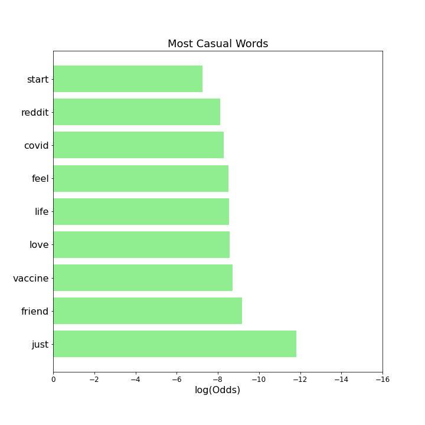
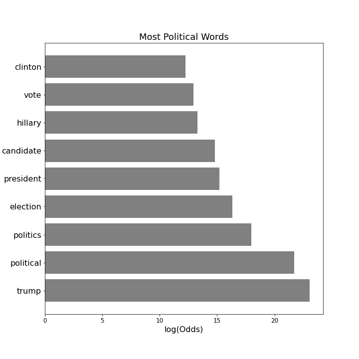

## Problem Statement

As of 2016, [roughly one third](https://www.pewresearch.org/internet/2016/10/25/political-content-on-social-media/) of Americans comment, discuss, or post about politics on social media. As a result, political campaigns have begun to invest significant resources into political advertising on social media. In order to craft targeted ads, political advertising agencies are investing significant resources into [identifying the populations of social media users discussing politics](https://www.americanbar.org/groups/crsj/publications/human_rights_magazine_home/voting-in-2020/political-advertising-on-social-media-platforms/). The goal of this project is to build a text classification model that can differentiate between casual and political conversations on social media to aid advertising agencies target particular users for specific ads. 

# Background

My models are trained using text data from the website reddit, with the submissions specifically coming from the subreddits: 
1. r/CasualConversation
2. r/PoliticalDiscussion

The CasualConversation subreddit is a forum dedicated having fun conversations "about anything that is on your mind". with 1.44 million members, there is a huge variety in conversation topics from advice, to discussing dinner plans, favorite memories. As a result, it serves as a great baseline signal for what average conversation looks like on social media.

The PoliticalDiscussion subreddit is a forum focused solely on posing questions regarding current politics, mainly centering on US politics as its core topic. The subreddit is home to 1.91 million redditors who have vigorous debates regarding political strategy and opinions on recent political news.

## Methodology

* Collect data from 10,000 posts from r/CasualConversations and r/PoliticalDiscussions using Pushshift API.
    * I collect an even number of posts from each subreddit so that the baseline accuracy is equivalent to the flip of a coin: 50/50. 
* Clean text data, engineer new features with NLP, and lemmatize text so that each word maintains its meaning but is reduced to its base form.  
* Split data into training and testing datasets to validate the performance of my model. Model will be created with training data, and then its accuracy will be tested using the testing data. 
* Vectorize the text data using TF-IDF methodology to account for outliers and weigh each word according to its importance to the meaning of a senetence. 
* Fit the data to a logistic regression and random forest classification model. Analyze the classification metrics to determine which model performed better. 

## Modeling Summary Table

|Model| Train Accuracy| Test Accuracy| AUC ROC| True Positive| True Negative| False Positive| False Negative|
|---|---|---|---|---|---|---|---|
|Logistic Regression| 1.0|0.989|0.989|1983|1984|21|24|
|Random Forest|1.0|0.990|0.990|1993|1981|12|26|

## Conclusions

* Sentiment and parts-of-speech analysis were not as useful as analyzing the vocabulary of a given text. 
* The large amount of data collected helped the logistic Regression and Random Forest performed almost identically well.
* While I was worried that the words "politic", "politics", and "political" were creating a leaky model, it turned out the random forest performed almost exactly the same as the model trained with those words included in training set. 
* There is a huge difference in the vocabulary used in r/PoliticalDiscussions compared to r/CasualConversation
* As a result, it is possible to classify posts with 99% accuracy , regardless of model. 

                             

## Recommendations and Next Steps

I would suggest that political advertising agencies use my random forest model for classifying whether social media posts are political in nature or not. The 99% accuracy suggests that the model is ready for beta tests on other subreddits and then to different social media sites other than reddit. However, before taking the model live, I would want to further analyze how overfit my model is to the training data by collecting another large batch of testing samples and assessing the predictive accuracy of my model. Furthermore, I would want to conduct a larger gridsearch for the random forest and logistic regression to ensure that I have optimized the hyperparameters as much as possible.    
